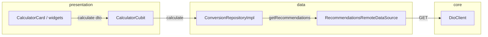

# Arquitectura y flujo de la aplicación

Este documento describe cómo está organizado el código bajo `lib/` y el recorrido típico desde el arranque hasta la llamada al API de recomendaciones.

## Visión por capas

No hay una carpeta `domain/` separada: la lógica de negocio de conversión vive en **data** (repositorio + fórmulas) y el **estado de pantalla** en **presentation** (Cubit). El **core** concentra red, tema, rutas y utilidades sin depender de features concretas.

| Capa | Rol |
|------|-----|
| **presentation** | Páginas, widgets, Cubits y estados de UI. |
| **data** | Datasources HTTP, implementación del repositorio, DTOs y modelos de respuesta. |
| **core** | Cliente Dio, `Result` / fallos de API, router, tema, `Env`. |

## Flujo de arranque

1. **`main.dart`** inicializa el binding, fija orientación vertical, carga `.env` y ejecuta `runApp(MyApp)`.
2. **`MyApp`** usa `MaterialApp.router` con **`appRouter`** (`core/router/app_router.dart`) y el tema global.
3. La ruta inicial **`/`** muestra **`SplashPage`**, que tras un delay navega con **`go_router`** a **`/calculator`** (sin dejar el splash en la pila de forma que el usuario vuelva atrás al splash).

## Flujo de la calculadora

1. **`CalculatorPage`** crea el grafo de dependencias para esa pantalla:
   - `DioClient(baseUrl: Env.baseUrl)`
   - `RecommendationsRemoteDataSource`
   - `ConversionRepositoryImpl`
   - `CalculatorCubit(repository: …)`
2. El **`BlocProvider`** expone el Cubit al árbol; **`CalculatorView`** → **`CalculatorBody`** pinta el fondo y centra la card.
3. **`CalculatorCard`** mantiene el estado local del formulario (`TextEditingController`, `ValueNotifier` de monedas y de TENGO/QUIERO). Al pulsar **Cambiar** arma un **`CalculatorDto`** y llama **`context.read<CalculatorCubit>().calculate(dto)`**.
4. **`CalculatorCubit`** emite `Loading`, invoca **`ConversionRepository.calculate`**, y según el **`Result`** emite **`Loaded`** (tasa + monto convertido) o **`Error`** (mensaje ya mapeado desde **`ApiFailure`**).
5. **`ConversionRepositoryImpl`** pide datos al datasource; si la respuesta es correcta, aplica la fórmula según **`ChangeType`**:
   - **Crypto → Fiat:** `converted = amount * rate`
   - **Fiat → Crypto:** `converted = amount / rate`  
   donde `rate` es `fiatToCryptoExchangeRate` del JSON (`data.byPrice`).

## Diagrama simplificado

## Estructura de carpetas (`lib/`)

- **`core/`** — `network/` (`dio_client`, `result`, `api_failure`), `router/`, `theme/`, `utils/` (`env`, logger).
- **`data/`** — `datasources/`, `repositories/`, `model/` (`request`, `response`, `enum`).
- **`presentation/`** — `page/`, `cubits/calculator/`, `widget/` (`calculator/`, `splash/`), `models/` (opciones de selección).

## Configuración del API

La URL base se lee de **`.env`** (`BASE_URL`). Si falta, se usa el fallback definido en **`core/utils/env.dart`** (misma base que el enunciado de la prueba).
